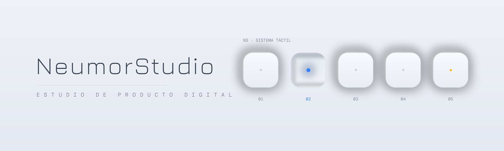

  

 

Diseñamos y operamos software que resuelve el día a día de peluquerías, restaurantes, gimnasios y comercios: presencia web, reservas, pagos y gestión. Producto propio, mantenido y en producción.

 

## 🧩 Productos

<table>
<tr>
<td width="50%" valign="top">

### Neumor Plantillas

Plataforma multi-tenant de sitios web por vertical — salón, restaurante, fitness y tienda — con panel de administración, reservas, presupuestos y notificaciones.

[`neumor-plantillas`](https://github.com/NeumorStudio/neumor-plantillas)

</td>
<td width="50%" valign="top">

### ElBooksyKiller

Sistema de reservas online para peluquerías: agenda por profesional, pagos con Stripe y confirmaciones automáticas por email.

[`elbooksykiller`](https://github.com/NeumorStudio/elbooksykiller)

</td>
</tr>
</table>

 

## ⚙️ Cómo trabajamos

Metodología asistida por IA con supervisión de ingeniería: cada cambio pasa por revisión técnica, pruebas automatizadas y control de calidad antes de llegar a producción.

- **Verticales, no genéricos** — cada producto nace de un sector concreto y sus flujos reales.
- **Multi-tenant desde el diseño** — una base de código, muchos negocios servidos.
- **Producción primero** — todo lo publicado está desplegado, monitorizado y con soporte.

 

## 🛠 Stack

 

---

**NeumorStudio** · Estudio de producto digital

[neumorstudio.com](https://www.neumorstudio.com) · [Panel de clientes](https://admin.neumorstudio.com)

